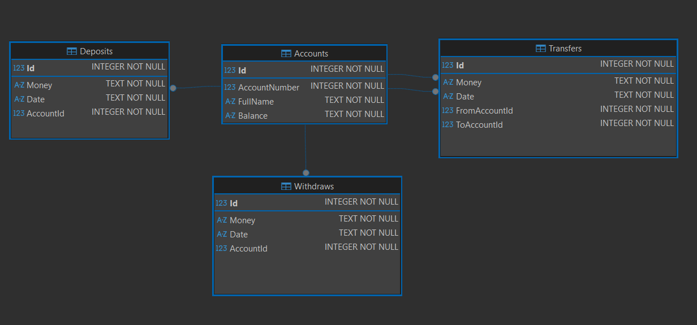

# Transaction Management System - ASP.NET Core MVC

A banking management system built with **ASP.NET Core 8 MVC**, following SOLID principles and Clean Architecture.

The project is written for softuni web exam task.  

---

## 🚀 Getting Started
1. **Clone the repository**: `git clone https://github.com/tozobg/c-sharp-web-fundamentals-exam.git`
2. **Configure Database**: Update the `ConnectionStrings` in `TransactionSystem.Web'/appsettings.json` to point to your local SQL Server instance.
3. **Apply Migrations**: Open the Package Manager Console. Change default project to `TransactionSystem.Data` and run: Update-Database

## StartUp 
TransactionSystem.Web -> Program.cs

## 📌 Features

### Core Operations
- Create Account
- Edit Account
- Deposit Money to Account
- Remove Deposit
- Withdraw Money from Account
- Remove Withdraw
- Transfer between accounts  (TODO)

### Architecture Highlights
- **Separation of concerns** across:
  - `TransactionSystem.Core`
  - `TransactionSystem.Data`
  - `TransactionSystem.Models`
  - `TransactionSystem.Web`

- **Unit of Work Pattern**  
- **Repository Pattern**  
- **DTO-based communication** 

### Database Provider
- **SQL Server

### NUnit Unit Tests (Temporary removed)
- Uses the **In-Memory Data Layer** for isolated testing  
- Covers:
  - Account creation
  - Deposit / Withdraw
  - Transfers
  - Error cases

---

## Database Structure (MSSQL)

### **Account**
| Column        | Type    |
|---------------|---------|
| Id            | int PK  |
| AccountNumber | int     | (Unique)
| FullName      | string  |
| Balance       | decimal |

### **Deposit**
| Column    | Type    |
|-----------|---------|
| Id        | int PK  |
| AccountId | FK → Account.Id |
| Money     | decimal |
| Date      | text    | (Datetime)

### **Withdraw**
| Column    | Type    |
|-----------|---------|
| Id        | int PK |
| AccountId | FK → Account.Id |
| Money     | decimal |
| Date      | text    | (Datetime)

### **Transfer**
| Column        | Type    |
|---------------|---------|
| Id            | int PK |
| FromAccountId | FK → Account.Id |
| ToAccountId   | FK → Account.Id |
| Money         | decimal |
| Date          | text    | (Datetime)

---

Enjoy exploring the project!